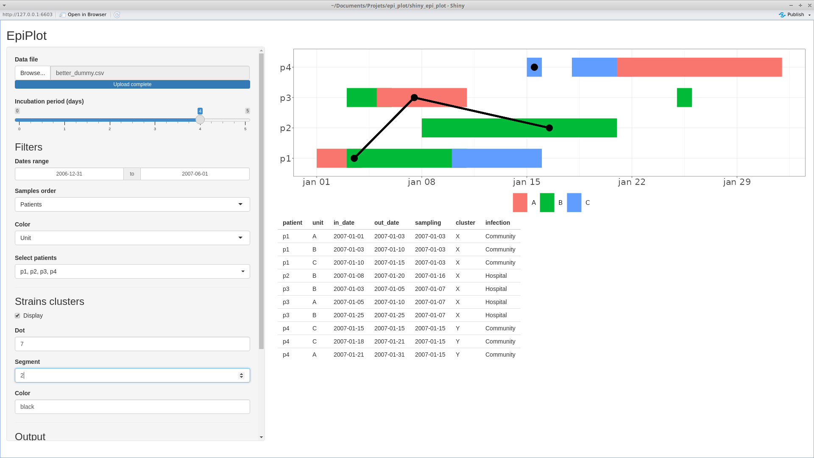

# epi_plot

Shiny interface for drawing Gantt plots dedicated to infection studies in hospital settings.  
This tool is still under development.

## Install
You only need to have Shiny installed and loaded in your R session.  
```
install.packages("shiny")
install.packages("shinyWidgets")
```
Then the easiest way to use Epi_plot is to start it through GitHub.  
```
library(shiny)
runGitHub("epi_plot", "Mauffrey")
```

## Input data example

| patient | unit | in_date    | out_date   | sampling   | cluster |
|---------|------|------------|------------|------------|---------|
| p1      | A    | 2007-01-01 | 2007-01-03 | 2007-01-03 | X       |
| p1      | B    | 2007-01-03 | 2007-01-10 | 2007-01-03 | X       |
| p1      | C    | 2007-01-10 | 2007-01-15 | 2007-01-03 | X       |
| p2      | B    | 2007-01-08 | 2007-01-20 | 2007-01-16 | X       |
| p3      | B    | 2007-01-03 | 2007-01-05 | 2007-01-07 | Y       |
| p3      | A    | 2007-01-05 | 2007-01-10 | 2007-01-07 | Y       |

Epi_plot will only works with these columns so don't change columns names.  
patient = patient id (should not be only a number)
unit = unit or service where the patient stayed
in_date = the date the patient entered the unit
out_date = the date the patient left the unit
sampling = the date of the first positive sampling (should be the same value for all line of the same patient)
cluster = genetic cluster (should be the same value for all line of the same patient)

Save your data as CSV.

You can use the example.csv file provided to test the tool.

## Screenshots



Use the difference options to select and filter your data.  
Then you can save you plot with the download function.
