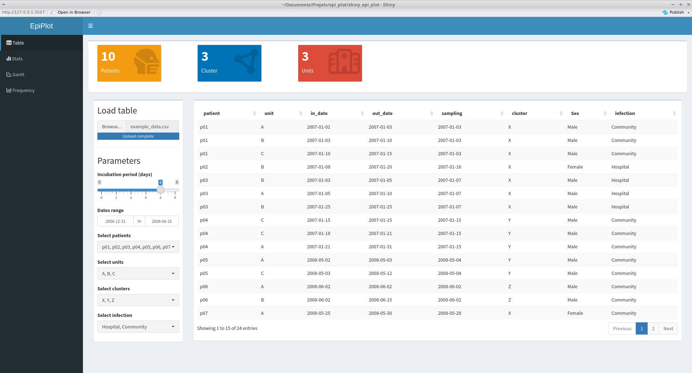
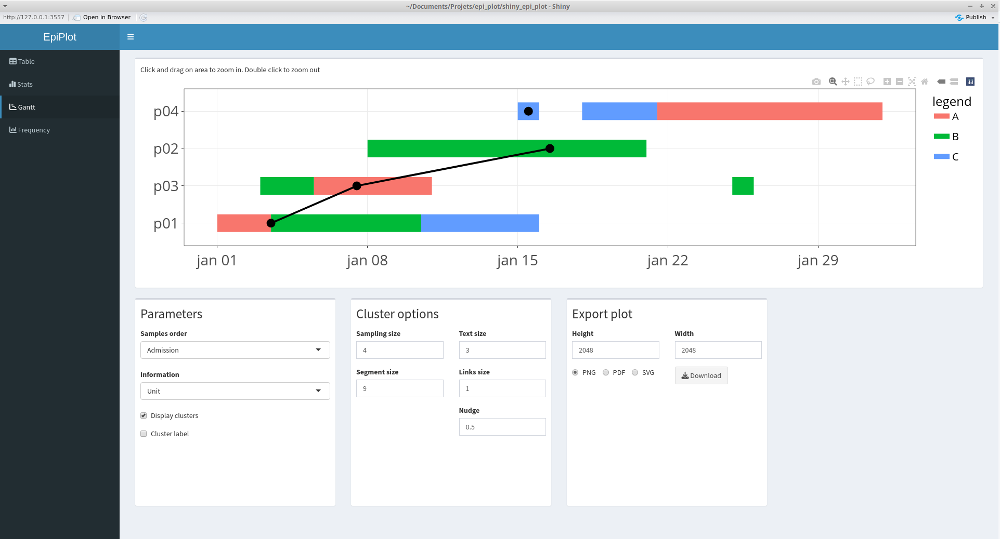
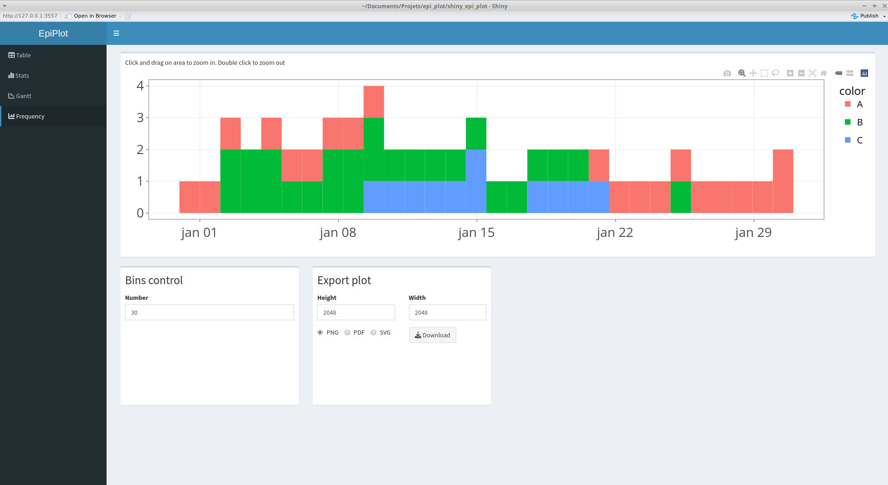

# EpiPlot

Shiny interface for drawing Gantt plots dedicated to infection studies in hospital settings.  
This tool is still under development.

## Install
You only need to have Shiny installed and loaded in your R session.  
```
install.packages("shiny")
```
Then the easiest way to use Epi_plot is to start it through GitHub.  
```
runGitHub("epi_plot", "Mauffrey")
```
The first time you run the script, some packages will be installed.

## Input data

The following table is an example of data you must provide to EpiPlot. Columns names should be changed (for the moment) and missing values could lead to errors. The example_data.csv file data provided can serve as template for your data.

| patient | unit | in_date    | out_date   | sampling   | cluster |
|---------|------|------------|------------|------------|---------|
| p01      | A    | 2007-01-01 | 2007-01-03 | 2007-01-03 | X       |
| p01      | B    | 2007-01-03 | 2007-01-10 | 2007-01-03 | X       |
| p01      | C    | 2007-01-10 | 2007-01-15 | 2007-01-03 | X       |
| p02      | B    | 2007-01-08 | 2007-01-20 | 2007-01-16 | X       |
| p03      | B    | 2007-01-03 | 2007-01-05 | 2007-01-07 | Y       |
| p03      | A    | 2007-01-05 | 2007-01-10 | 2007-01-07 | Y       |

patient = patient id (should not be only a number)
unit = unit or service where the patient stayed
in_date = the date the patient entered the unit
out_date = the date the patient left the unit
sampling = the date of the first positive sampling (should be the same value for all line of the same patient)
cluster = genetic cluster (should be the same value for all line of the same patient)

Any additional column with categorical data (e.g. sex) will be integrated and will be available for sample classification in the plots. 

## How to use

In the first tab, use the "Browse" button to load your data. You table should immediatly appear as well as statistics boxes. In this tab, you can change the incubation period (to declare an infection as hospital or community acquired) and the dates range. This will directly modify your table as well as the differents plots in the other tabs.



The Gantt and frequency tabs display the Gantt and frequency plots, respectively, based on the table loaded and modified at the previous step. It is possible to click and drag directly on the plot to define the dates range. This will only affect x axis (dates) and not the y axis (patients). Double click allows to go back to the initial dates range.  
Different parameters can be adjusted in order to organize the plot as you want. Finally, you can export your plot using the "Export plot" options available.  




